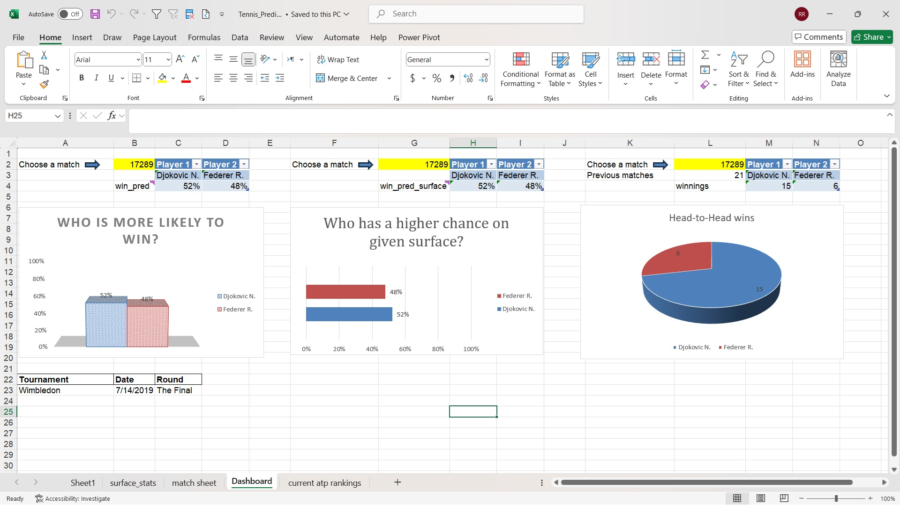

# 🎾 Tennis Match Predictor – Excel Edition

This is a no-code machine learning-style project built entirely in **Microsoft Excel**.

## 💡 What it does
Predicts the winner of a tennis match based on:
- Player rankings
- Historical win rates by surface (Hard / Clay / Grass)
- Head-to-head stats
- Fully dynamic interface with dropdowns and live-updating charts

## 📊 Features
- 📋 Match selection from real ATP data
- 📈 Probability predictions based on multiple factors
- 🧠 Head-to-head win breakdown with pie chart
- 📉 Comparison charts: ranking-based vs surface-based
- ✅ Built with advanced Excel functions: `XLOOKUP`, `COUNTIFS`, `TEXT`, `IF`, conditional formatting

## 🛠 Built With
- Microsoft Excel (Office 365)
- Real ATP match data (up to 2023)

## 👀 Preview

## Download here:

## 🧑‍💻 Author
Rotem Ravid  
Aspiring Data Analyst & Sports Data Enthusiast

